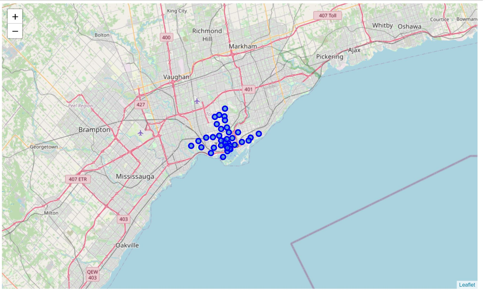
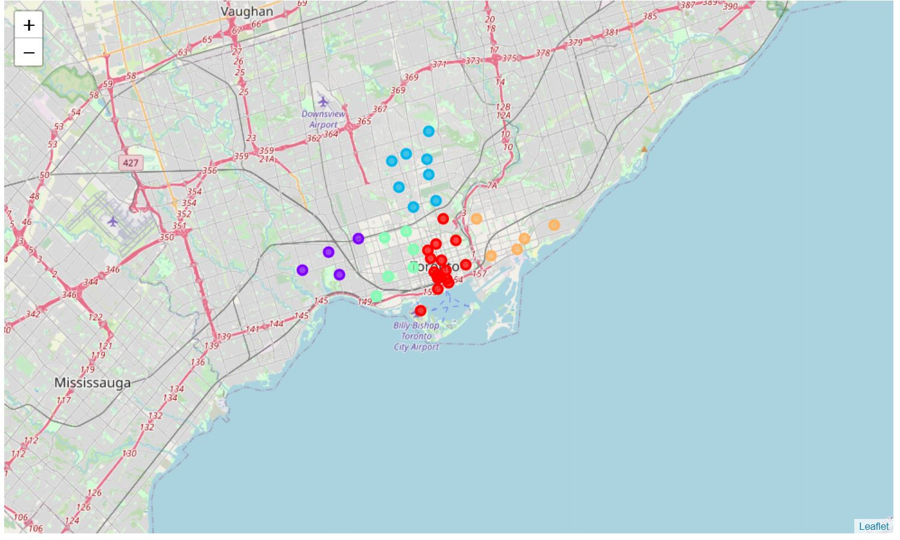

# Segmenting-and-Clustering-Neighborhoods
Coursera assignment to explore and cluster the neighborhoods in Toronto.
Explore, segment, and cluster the neighborhoods in the city of Toronto. The neighborhood data is not readily available on the internet. 

For the Toronto neighborhood data, a Wikipedia page exists that has all the information we need to explore and cluster the neighborhoods in Toronto. The notebook uses code to scrape the following Wikipedia page, https://en.wikipedia.org/wiki/List_of_postal_codes_of_Canada:_M, in order to obtain the data that is in the table of postal codes and to transform the data into a pandas dataframe 

